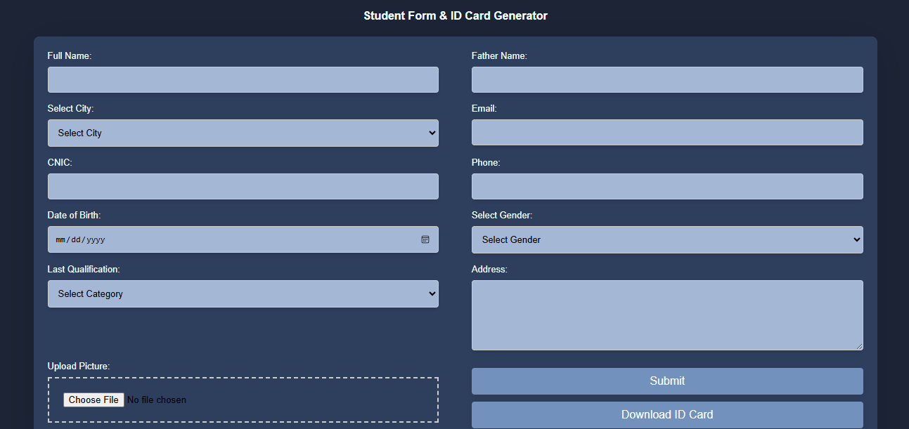
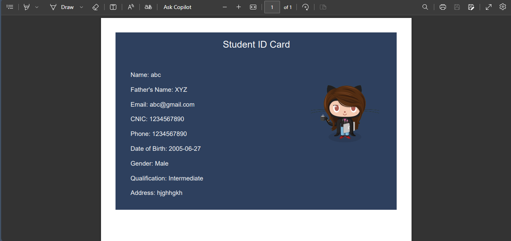

# Student Form & ID Card Generator

This project is a Javascript that allows users to fill out a student registration form and generate a corresponding student ID card. The project was developed as part of an internship at TechNet Cloud.

## Features

- **Student Registration Form**: A form to collect various student details such as city, full name, father's name, email, CNIC, phone number, date of birth, gender, last qualification, address, and a profile picture.
- **ID Card Generation**: Using the jsPDF library, the application generates a PDF of the student's ID card with the provided details and uploaded picture.
- **Form Validation**: Ensures all required fields are filled before submission.

## Technologies Used

- **HTML5**: For the structure of the web page.
- **CSS3**: For styling the form and the overall page layout.
- **JavaScript**: For handling form submission, validation, and ID card generation.
- **jsPDF**: A JavaScript library to generate PDF files directly in the browser.

## Screenshots




## How to Run the Project

1. **Clone the Repository**:
    ```sh
    git clone https://github.com/your-username/student-form-id-generator.git
    cd student-form-id-generator
    ```

2. **Open `index.html` in a Browser**:
    - Navigate to the project directory and open `index.html` in your preferred web browser.

3. **Fill Out the Form**:
    - Complete all the fields in the registration form.

4. **Generate ID Card**:
    - Click the "Download ID Card" button to generate and download the student's ID card as a PDF file.

## Project Structure

```plaintext
student-form-id-generator/
├── index.html
├── style.css
├── script.js
├── README.md
└── screenshots/
    ├── form.png
    └── id_card.png
